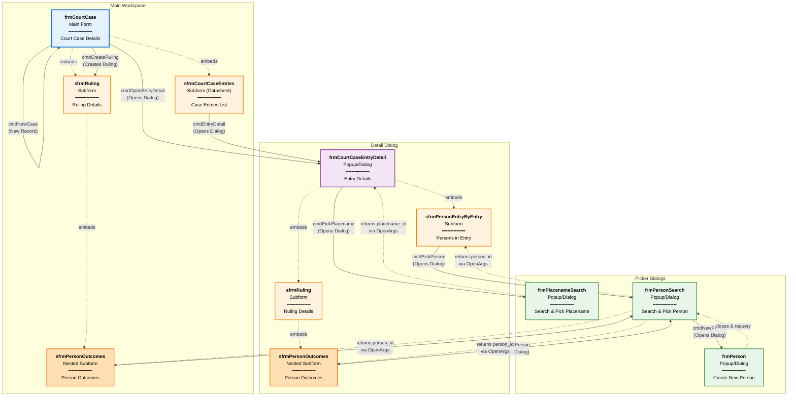

# DigiDiggie Minimal App - Architecture Overview

## Form Interconnections Diagram



---

## Architecture Components

### 1. Main Workspace (Blue)

**Primary Form**: `frmCourtCase`
- **Purpose**: Central data entry workspace for court cases
- **Mode**: Continuous form view
- **Contains**:
  - `sfrmCourtCaseEntries` - Datasheet subform listing all entries in current case
  - `sfrmRuling` - Single ruling details for the case
    - `sfrmPersonOutcomes` - Nested subform for person outcomes within ruling
- **Key Actions**:
  - `cmdNewCase` - Navigate to new record
  - `cmdOpenEntryDetail` - Open detail dialog for selected entry
  - `cmdCreateRuling` - Create ruling record (button hides after creation)

### 2. Detail Dialog (Purple)

**Dialog Form**: `frmCourtCaseEntryDetail`
- **Purpose**: Detailed view/edit of a single court case entry
- **Mode**: Modal dialog (acDialog)
- **Opened From**: 
  - `frmCourtCase.cmdOpenEntryDetail`
  - `sfrmCourtCaseEntries.cmdEntryDetail` (button in datasheet)
- **Contains**:
  - `sfrmPersonEntryByEntry` - Persons linked to this specific entry
  - `sfrmRuling` - Ruling details (reused component)
    - `sfrmPersonOutcomes` - Person outcomes (reused nested component)
- **Key Actions**:
  - `cmdPickPlacename` - Opens placename picker dialog

### 3. Picker Dialogs (Green)

**Utility Forms for Data Selection**:

#### `frmPlacenameSearch`
- **Purpose**: Search and select placenames
- **Mode**: Modal dialog (acDialog)
- **Controls**:
  - `txtSearch` - Search input
  - `lstResults` - Results listbox (queries via `qPlacenameSearch`)
  - `cmdSearch` - Execute search
  - `cmdSelect` - Return selected ID to caller
  - `cmdCancel` - Close without selection
- **Data Return**: Uses OpenArgs pattern to write `placename_id` back to caller

#### `frmPersonSearch`
- **Purpose**: Search and select existing persons
- **Mode**: Modal dialog (acDialog)
- **Controls**:
  - `txtSearch` - Search input
  - `lstResults` - Results listbox (queries via `qPersonSearch`)
  - `cmdSearch` - Execute search
  - `cmdSelect` - Return selected ID to caller
  - `cmdNewPerson` - Open person creation form
  - `cmdCancel` - Close without selection
- **Data Return**: Uses OpenArgs pattern to write `person_id` back to caller

#### `frmPerson`
- **Purpose**: Create new person records
- **Mode**: Modal dialog (acDialog), data entry mode
- **Opened From**: `frmPersonSearch.cmdNewPerson`
- **Behavior**: After closing, `frmPersonSearch` requeries to show newly created person

---

## Key Design Patterns

### OpenArgs Communication Pattern

Picker forms receive calling context via `OpenArgs` parameter:

```vb
' Caller opens picker with context
DoCmd.OpenForm "frmPlacenameSearch", , , , , acDialog, _
    "caller=frmCourtCaseEntryDetail;target=txtPlacenameId"

' Picker parses OpenArgs and writes back selected ID
ParseOpenArgs Forms!frmPlacenameSearch.OpenArgs, callerForm, targetControl
Forms(callerForm).Controls(targetControl).Value = selectedId
```

**Format**: `caller={formName};target={controlName}`

**Advantages**:
- Decouples picker forms from specific callers
- Single picker form can serve multiple contexts
- Clean data return mechanism without global variables

### Auto-populate Display Fields

Display fields are automatically populated when forms load or after picker selection:

**Implementation**:
- `frmCourtCaseEntryDetail` has `OnLoad` event that calls `UpdatePlacenameDisplay()`
- After picker closes, display field is refreshed
- Ensures display field is always in sync with ID field

**Benefit**: Users see placename text immediately without manual lookup

### Initial Results in Picker Dialogs

Picker forms show top 50 results on load instead of empty list:

**Implementation**:
- `frmPlacenameSearch_OnLoad()` - Shows 50 placenames ordered alphabetically
- `frmPersonSearch_OnLoad()` - Shows 50 persons ordered by name

**Benefits**:
- Users can browse common entries without typing
- Faster selection for recently added items
- Better UX than empty search form

### Create & Link Workflow

Direct creation and linking of new persons without returning to search:

**Flow**:
1. User clicks "Pick Person" → opens `frmPersonSearch` with OpenArgs
2. User clicks "New Person" → opens `frmPerson` with same OpenArgs
3. User creates person → on close, new `person_id` written directly to calling form
4. Both picker forms close automatically

**Implementation**:
- `cmdNewPerson` passes OpenArgs through to `frmPerson`
- `frmPerson_OnClose()` parses OpenArgs and writes back directly
- Eliminates search → select → close → requery steps

**Benefit**: Reduces 5-step workflow to 2 steps

### Contextual Person Search

Person search includes community information for disambiguation:

**Query Enhancement**:
```sql
SELECT person_id, full_name, birth_year, community_name
FROM person
WHERE full_name LIKE [pSearch]
ORDER BY full_name
```

**Benefit**: Distinguishes between people with same names by showing their community

### Dynamic Ruling Creation

Ruling records are created on-demand rather than automatically:

1. User clicks `cmdCreateRuling` button on `frmCourtCase`
2. VBA checks if ruling already exists for current case
3. If not, creates minimal ruling record with default `ruling_type_id`
4. Button hides after creation (via `frmCourtCase_OnCurrent` and `sfrmRuling_OnCurrent`)
5. Ruling subform displays data entry controls

**Benefits**:
- Avoids orphaned ruling records
- User explicitly controls when to add ruling
- UI clearly communicates ruling state (button visible = no ruling)

### Shared Subform Components

`sfrmRuling` and `sfrmPersonOutcomes` are reused across contexts:
- Main form (`frmCourtCase`)
- Detail dialog (`frmCourtCaseEntryDetail`)

**Implementation**: Same form embedded in multiple parent forms

**Benefits**:
- Single source of truth for ruling/outcome UI
- Reduces code duplication
- Consistent behavior across contexts

### Form Hierarchy

```
frmCourtCase (Main)
├── sfrmCourtCaseEntries (Datasheet)
├── sfrmRuling
│   └── sfrmPersonOutcomes (Nested)
└── Buttons (cmdNewCase, cmdOpenEntryDetail, cmdCreateRuling)

frmCourtCaseEntryDetail (Dialog)
├── sfrmPersonEntryByEntry
├── sfrmRuling
│   └── sfrmPersonOutcomes (Nested)
└── Button (cmdPickPlacename)

frmPlacenameSearch (Dialog)
└── Search/Select UI

frmPersonSearch (Dialog)
├── Search/Select UI
└── Opens: frmPerson (Dialog)
```

---

## Data Flow

### Court Case Entry Workflow

1. **Start**: User opens `frmCourtCase` (main workspace)
2. **Navigate**: User can browse existing cases or click `cmdNewCase` for new record
3. **Add Entries**: User adds entries via `sfrmCourtCaseEntries` datasheet
4. **Edit Details**: User clicks `cmdOpenEntryDetail` or datasheet button to open `frmCourtCaseEntryDetail`
5. **Link Placename**: In detail dialog, user clicks `cmdPickPlacename` → searches → selects → ID written to `txtPlacenameId`
6. **Link Persons**: User adds persons via `sfrmPersonEntryByEntry`
   - Click `cmdPickPerson` → search existing or create new → select → ID written to subform
7. **Create Ruling**: Back on main form, user clicks `cmdCreateRuling` when ready
8. **Record Outcomes**: User enters outcome data in `sfrmPersonOutcomes` within ruling

### Search & Select Flow

**Placename Selection**:
```
frmCourtCaseEntryDetail.cmdPickPlacename
  → Opens frmPlacenameSearch (with OpenArgs)
    → User types in txtSearch
    → Clicks cmdSearch
    → Selects from lstResults
    → Clicks cmdSelect
      → ParseOpenArgs extracts caller info
      → Writes placename_id back to frmCourtCaseEntryDetail.txtPlacenameId
      → UpdatePlacenameDisplay() updates display field
  → Dialog closes
```

**Person Selection**:
```
sfrmPersonEntryByEntry.cmdPickPerson
  → Opens frmPersonSearch (with OpenArgs)
    → [Option A] Search existing
      → User types in txtSearch → cmdSearch → select from lstResults → cmdSelect
    → [Option B] Create new
      → cmdNewPerson
        → Opens frmPerson (data entry mode)
        → User enters person details
        → Closes, frmPersonSearch requeries
        → User selects newly created person
    → Writes person_id back to sfrmPersonEntryByEntry.txtPersonId
  → Dialog closes
```

---

## Module Organization

### Generation Module: `minimal_app_generator.vba`

**Purpose**: Contains all form creation code  
**Main Entry Point**: `BuildAllForms()`  
**Functions**: 
- `DeleteFormsIfExist()` - Cleanup before generation
- `CreateQueries()` - Creates `qPlacenameSearch`, `qPersonSearch`
- `Create_frmCourtCase()` - Main workspace form
- `Create_sfrmCourtCaseEntries()` - Datasheet subform
- `Create_frmCourtCaseEntryDetail()` - Detail dialog
- `Create_sfrmPersonEntryByEntry()` - Person-entry linkage
- `Create_sfrmRuling()` - Ruling details
- `Create_sfrmPersonOutcomes()` - Person outcomes
- `Create_frmPlacenameSearch()` - Placename picker
- `Create_frmPersonSearch()` - Person picker
- `Create_frmPerson()` - Person creation
- `CreateLabel()` - Helper function

**Lifecycle**: Import → Run `BuildAllForms` → Can be removed after generation

### Runtime Module: `minimal_app_runtime.vba`

**Purpose**: Contains all event handlers for form controls  
**Functions**: 35+ event handlers including:
- `frmCourtCase_OnCurrent()` - Updates button visibility
- `frmCourtCase_cmdNewCase_Click()` - New case record
- `frmCourtCase_cmdOpenEntryDetail_Click()` - Opens detail dialog
- `frmCourtCase_cmdCreateRuling_Click()` - Creates ruling record
- `frmCourtCaseEntryDetail_OnLoad()` - **NEW**: Auto-populates placename display
- `sfrmRuling_OnCurrent()` - Dynamic ruling UI visibility
- `frmPlacenameSearch_OnLoad()` - **NEW**: Shows initial results (top 50)
- `frmPlacenameSearch_cmd*_Click()` - Placename picker handlers
- `frmPersonSearch_OnLoad()` - **NEW**: Shows initial results (top 50)
- `frmPersonSearch_cmd*_Click()` - Person picker handlers
- `frmPerson_OnClose()` - **NEW**: Returns new person_id to caller (create & link)
- `ParseOpenArgs()` - Helper to parse OpenArgs string
- `UpdatePlacenameDisplay()` - Refresh display field

**Lifecycle**: Must remain in database permanently for forms to function

---

## Database Schema Dependencies

### Primary Tables

- `court_case` - Main case records
- `court_case_entry` - Entries within cases
- `person` - Person records
- `person_entry` - Links persons to case entries
- `ruling` - Case rulings (1:1 with court_case)
- `person_outcome` - Person outcomes within rulings
- `placename` - Placename reference data

### Lookup Tables

- `ruling_type` - Types of rulings
- `legal_source` - Legal source references
- `role` - Person roles
- `outcome` - Outcome types
- `season` - Season references
- `source` - Source references

### Queries

- `qPlacenameSearch` - Parameterized query for placename search
- `qPersonSearch` - Parameterized query for person search

---

## UI Behavior Rules

### Button Visibility Logic

**`cmdCreateRuling` Button**:
- **Visible When**: Current case has no ruling record
- **Hidden When**: Current case has a ruling record
- **Controlled By**: 
  - `frmCourtCase_OnCurrent()` - Checks on record navigation
  - `sfrmRuling_OnCurrent()` - Updates when ruling state changes

### Ruling Subform Dynamic Display

**When No Ruling Exists**:
- Show: `lblNoRuling` ("No ruling recorded")
- Hide: All data entry controls (textboxes, combos, nested subforms)
- Show: `cmdCreateRuling` button on parent form

**When Ruling Exists**:
- Hide: `lblNoRuling`
- Show: All data entry controls
- Show: `sfrmPersonOutcomes` nested subform
- Hide: `cmdCreateRuling` button on parent form

**Implementation**: `sfrmRuling_OnCurrent()` event handler

### Form Opening Modes

- **Main Workspace**: `frmCourtCase` opens in normal mode (continuous form)
- **Detail Dialog**: `frmCourtCaseEntryDetail` opens with `acDialog` (modal, blocks parent)
- **Picker Dialogs**: All search forms open with `acDialog` (modal)
- **Person Creation**: `frmPerson` opens with `acFormAdd` mode (data entry only)

---

## Future Considerations

### Extensibility Points

1. **Additional Pickers**: Pattern can be extended for other lookup tables
2. **Validation Rules**: Add validation in event handlers before save
3. **Audit Trail**: Log changes in OnUpdate events
4. **Advanced Search**: Enhance picker queries with multiple criteria
5. **Reporting**: Add report generation buttons to main form

### Known Limitations

1. **Single Ruling Per Case**: Current design enforces 1:1 relationship
2. **No Undo**: Form generation overwrites existing forms
3. **Hard-coded References**: VBA uses explicit form/control names
4. **No Concurrent Editing**: Standard Access behavior (optimistic locking)
5. **Windows Only**: MS Access requires Windows environment

### Performance Considerations

- Datasheet subforms load all records (consider filtering for large datasets)
- Picker queries use `LIKE '%search%'` (consider indexed columns)
- Nested subforms can impact performance (currently 2 levels deep)

---

## Testing Checklist

### Form Generation
- [ ] Import both VBA modules (`generator` and `runtime`)
- [ ] Run `BuildAllForms` without errors
- [ ] All 9 forms created successfully
- [ ] Both queries (`qPlacenameSearch`, `qPersonSearch`) exist

### Main Workspace
- [ ] `frmCourtCase` opens and displays court case data
- [ ] `cmdNewCase` creates new record
- [ ] `sfrmCourtCaseEntries` displays entries, allows add/edit
- [ ] `cmdOpenEntryDetail` opens detail dialog with correct entry
- [ ] `cmdCreateRuling` creates ruling (only when none exists)
- [ ] Button visibility updates correctly on record navigation
- [ ] `sfrmRuling` shows/hides controls based on ruling existence

### Detail Dialog
- [ ] `frmCourtCaseEntryDetail` opens from main form
- [ ] Entry data pre-populated correctly
- [ ] `cmdPickPlacename` opens placename picker
- [ ] Selected placename ID written back correctly
- [ ] Display field updates after selection
- [ ] `sfrmPersonEntryByEntry` allows adding/removing persons
- [ ] Person picker returns correct person_id

### Picker Dialogs
- [ ] `frmPlacenameSearch` opens, search works, results display
- [ ] Placename selection returns to caller successfully
- [ ] `frmPersonSearch` opens, search works, results display
- [ ] Person selection returns to caller successfully
- [ ] `cmdNewPerson` opens person form
- [ ] New person appears in search results after creation
- [ ] Cancel buttons close without errors

### Data Integrity
- [ ] All foreign key relationships respected
- [ ] No orphaned records created
- [ ] Ruling creation follows business rules
- [ ] Person outcomes require existing ruling

---

## Maintenance Notes

### Modifying Forms

**DO NOT** edit generated forms directly in Access. Instead:

1. Modify VBA generator code in `minimal_app_generator.vba`
2. Delete existing forms (or run `DeleteFormsIfExist()`)
3. Re-run `BuildAllForms`
4. Test all functionality

### Adding Event Handlers

When adding new form controls that need events:

1. Add control creation code to appropriate `Create_*` function in generator
2. Set `OnClick` (or other event) property to call function in runtime module
3. Add event handler function to `minimal_app_runtime.vba`
4. Follow naming convention: `{formName}_{controlName}_{Event}`

### Troubleshooting

**"Compile Error" on form open**:
- Check VBA references (Tools → References)
- Ensure `minimal_app_runtime.vba` is imported
- Verify function names match OnClick properties

**Picker forms return wrong data**:
- Check OpenArgs format: `caller={form};target={control}`
- Verify `ParseOpenArgs()` implementation
- Debug with `Debug.Print` statements

**Ruling button doesn't hide**:
- Verify `frmCourtCase_OnCurrent` is called (add Debug.Print)
- Check `sfrmRuling_OnCurrent` implementation
- Ensure ruling record exists in database

---

## References

- **Requirements**: [MINIMAL_APP.md](MINIMAL_APP.md)
- **Setup Guide**: [../../docs/ACCESS-APP-SETUP.md](../../docs/ACCESS-APP-SETUP.md)
- **Database Linking**: [../../docs/LINKED-DATABASE.md](../../docs/LINKED-DATABASE.md)
- **Generator Code**: [minimal_app_generator.vba](minimal_app_generator.vba)
- **Runtime Code**: [minimal_app_runtime.vba](minimal_app_runtime.vba)
- **Schema**: [../schema/digidiggie_en_tng.sql](../schema/digidiggie_en_tng.sql)
